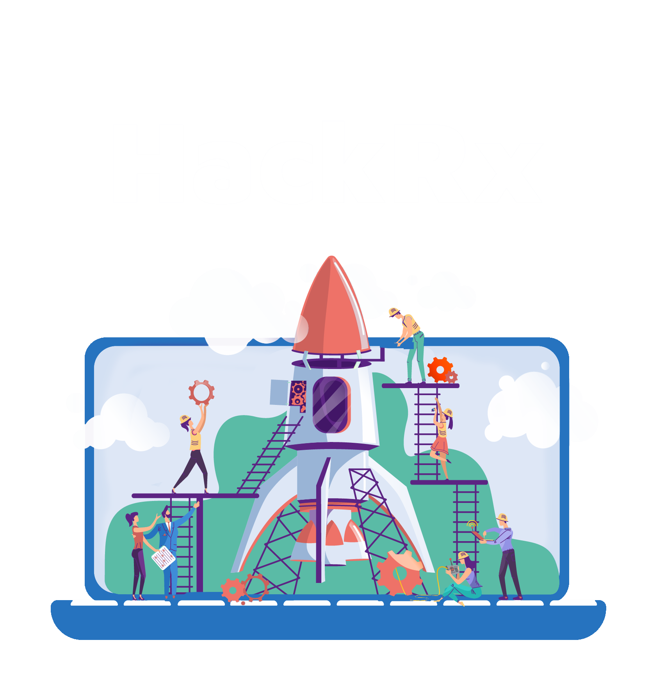
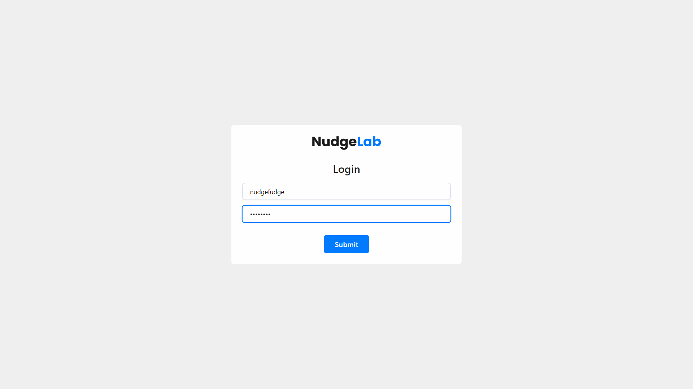
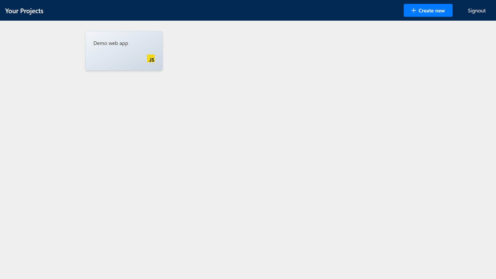
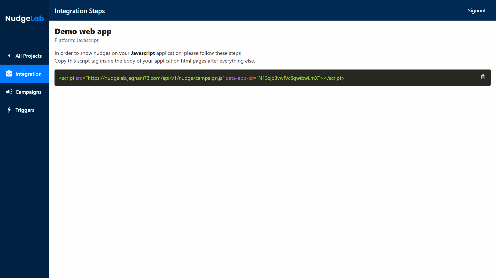
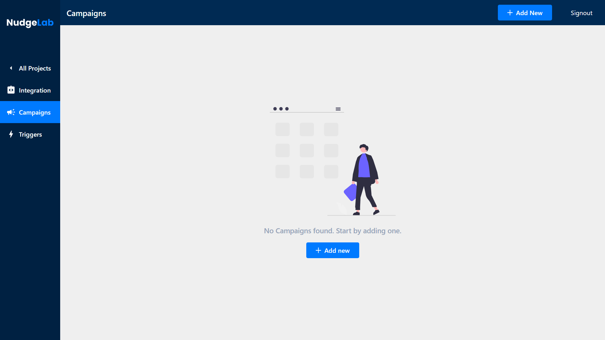
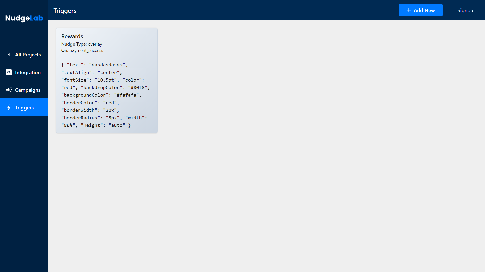
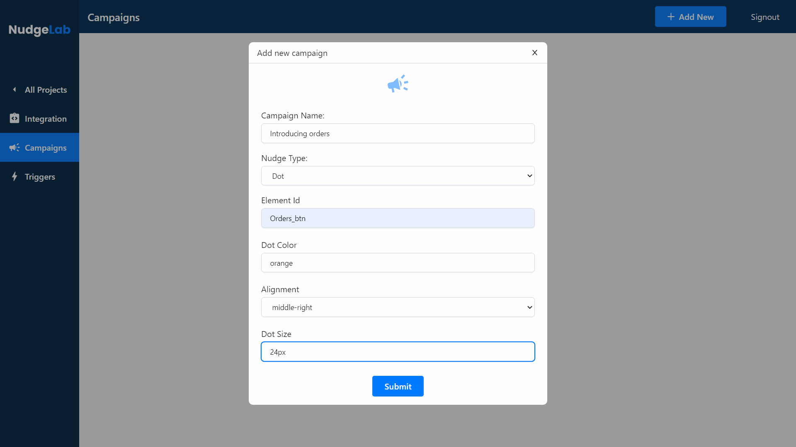
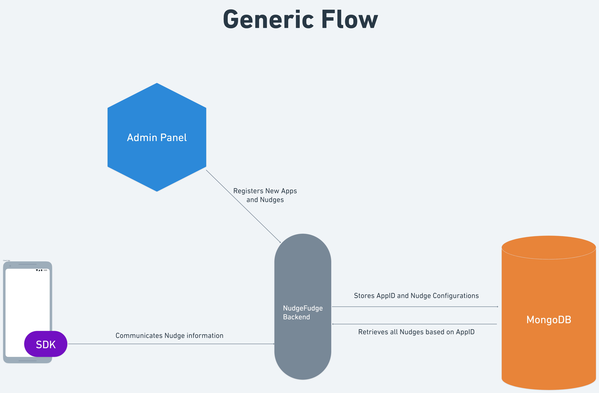
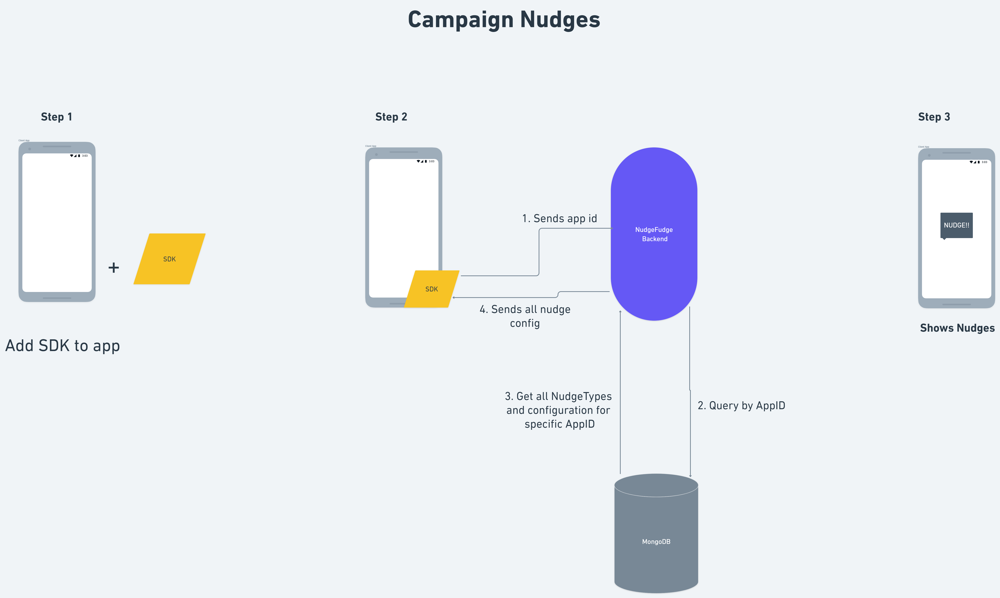
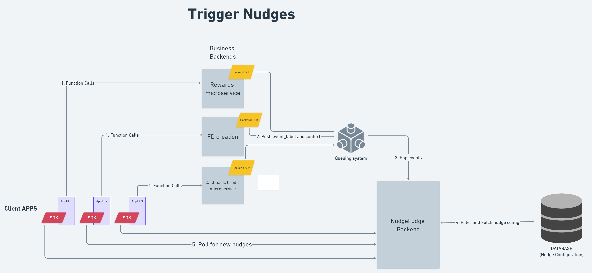

<div align="center">
  
</div>
<div align="center">
  
</div>

<br>
<p align="center">
<b>Team NudgeFudge presents NudgeLab.
<br>
No Code App Nudges</b>
</p>
<blockquote align="center"> 
  built on <span style="color: #8b0000;">☕</span> at <a href="https://hackrx.in">HackRx3.0</a>.

</blockquote>

# 💡 Problem Statement

Develop an in-app tool to allow setting up in-app nudges for various use cases, tool to allow nudge configuration on screen without need of having to code them on the screen / per use case.

# 🧠 Knowledge Primer

- A _Nudge_ is a visual element that is used to draw attention of the user to something, for example a new section in an application.
- There are two types of _Users_ that we have considered
  - **Admin**, a kind of user that adds the nudges.
  - **Client** are the ones for which the nudges are created.
- We have considered there are two types of ways to render a nudge
  - **Campaign**s, that can be run manually by _Admin_.
  - **Trigger** based, that are displayed after execution of a particular function, identified via unique `event_label`.
- Our implementation builds upon the existing backend servers of a business. These backends are referred to as **Business Backend**.

# 📺 Preview

<div align="center">
  
</div>
<div align="center">
  
</div>
<div align="center">
  
</div>
<div align="center">
  
</div>
<div align="center">
  
</div>
<div align="center">
  
</div>

# 💻 Tech Stack

- MongoDB
- ExpressJS
- ReactJS
- NodeJS
- TypeScript
- Redis

# 🔧 Utilisation

1. Go to the **[`Admin Dashboard`](https://nudgelab.vercel.app)** and create your project
2. In your project, add some nudges
3. Copy the script tag generated and paste it at the end of your `body` element

```html
<body>
  <!-- your code -->
  <script
    src="https://nudgelab.jagnani73.com/api/v1/nudge/campaign.js"
    data-app-id="demo-app-id"
  ></script>
</body>
```

# 📦 Inside the box

## 1. System Architecture Diagram

- Every project created is associated with its own unique `app_id` that makes the project, and all the nudges created under it independent of the platform.
- The ideal implementation of our application consists of a _Client SDK_, _Backend SDK_, and a _Backend Server_, _Frontend Server_.
- The _admin_ once authenticated on the **Frontend Server**, creates a project (and in it the nudges) that communicates with the **Backend Server**; stores the data.
- The **Client SDK** essentially works as a CDN that at the end renders the nudge on when and where needed. It handles the _Campaign Nudges_ by fetching all of the configured _campaign_ nudges for the specified `app_id`.
- Since we are building upon an existing _business backend_, there are API calls present. Our **Backend SDK** intercepts those calls and injects an `event_label` to the data. This data is then pushed to a SMQ (Simple Message Queue).
- The **Backend Server** has a listener on the queue and pops every message received in the queue. It then filters and fetches out the nudges based on the `event_label` and `app_id`. These fetched configurations are then pushed back to the **Client SDK** that is listening to a web socket for these **Trigger Nudges**.
- On receiving configuration on the socket, the **Client SDK** again renders the requested nudges on the application.

<div align="center">
  
</div>
<div align="center">
  
</div>
<div align="center">
  
</div>

## 2. Admin Flow

- The _Admin_ will authenticate itself.
- It will then create a project.
- Inside the project, there is a application specific SDK/CDN `script` that needs to be pasted in the client application.
- It will then create the desired nudges in the project.

# ⏭️ What's next

- Add more types of nudges, with more customizing options
- Dynamic drag and drop to get IDs of elements
- Analytics for the nudges and how the user responds to them; tracking user engagement
- Using a DLQ (Dead Letter Queue) for nudges that were not able to be received; cases of failure of delivery
- Adding support for more platforms
- Adding user specific nudges

# 📜 License

`NudgeLab` is available under the MIT license. See the [`LICENSE`](https://github.com/HackRx3/PS1_NudgeFudge/blob/main/LICENSE) file for more info.

# 🤝 Contributing

Please read [`Contributing.md`](https://github.com/HackRx3/PS1_NudgeFudge/blob/main/Contributing.md) for details on our code of conduct, and the process for submitting pull requests to us.

# 💥 Contributors

<a href="https://github.com/HackRx3/PS1_NudgeFudge/graphs/contributors">

</a>
                                                                                  
# 🚨 Forking this repo

Many people have contacted us asking if they can use this code for their own websites. The answer to that question is usually "yes", with attribution. There are some cases, such as using this code for a business or something that is greater than a personal project, that we may be less comfortable saying yes to. If in doubt, please don't hesitate to ask us.

We value keeping this site open source, but as you all know, _**plagiarism is bad**_. We spent a non-negligible amount of effort developing, designing, and trying to perfect this iteration of our website, and we are proud of it! All we ask is to not claim this effort as your own.

Refer to this handy [quora post](https://www.quora.com/Is-it-bad-to-copy-other-peoples-code) if you're not sure what to do. Thanks!
